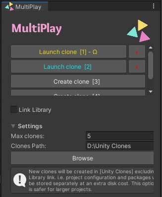
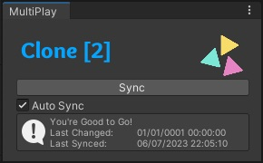

# MultiPlay 
*Runs multiple copies of Unity Editor.*

## Installation ##
In Unity Package Manager (UPM) Add Package from git URL:<BR>
https://github.com/muammar-yacoob/multiplay.git<br><br>
Or get the [Unity Package Installer](../../releases/download/v1.0.0/Install-com.sparkgames.multiplay-latest.unitypackage)<br>

It should be added to Unity menus under: *<font color=#eeeeee>`[Tools > MultiPlay]`</font>*


## Usage

1. Navigate to `Tools > MultiPlay > Client Manager`.
   
2. Click `Create Client`. The button will be deactivated as long as the client window is open.

<br>

3. On the newly launched Unity project, navigate again to `Tools > MultiPlay > Client Manager`. This time you will get a different tool window.

4. Make any changes to your scene in the original project editor and **click save in the original project** to propagate the changes across all launched clients.

5. Unless `[Auto Sync]` is ticked at the client side, you will have to press the `[Sync]` button every time you make changes to the original project.

<br>


## Common Questions & Issues

### Which Client?

To figure out which client you are running, attach the `WhichClone` script to any game object in the scene. Alternatively, you may use the below script:

```csharp
    void Start()
    {
        #if !UNITY_EDITOR 
        return;
        #endif

        int cloneIndex = MultiPlay.Utils.GetCurrentCloneIndex();

        if (cloneIndex == 0) Debug.Log("MultiPlay is running on: Main Project/Server");
        else Debug.Log($"MultiPlay is running on Client: {cloneIndex}");
    }
```
>Note: Newer Unity Editor versions may complain about `Sharing Violation` due to sharing the Library folder amongst clients; Although it will not matter in most cases, you may opt to be on the safer side and turn off the `[Link Library]` option from the settings drop-down menu below the client buttons. Alternatively, you may simply turn off Unity’s `[Directory Monitoring]` from `Edit> Preferences> General> Directory Monitoring`
